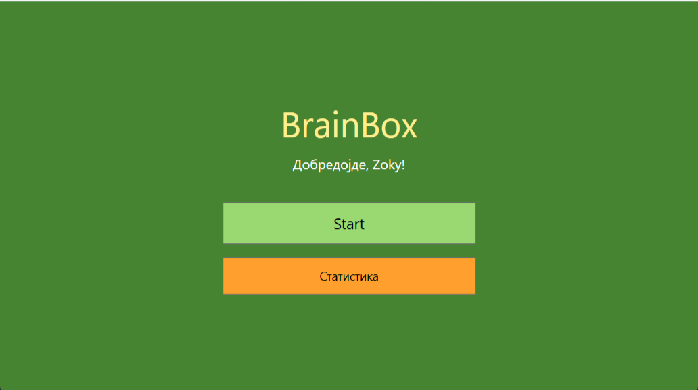
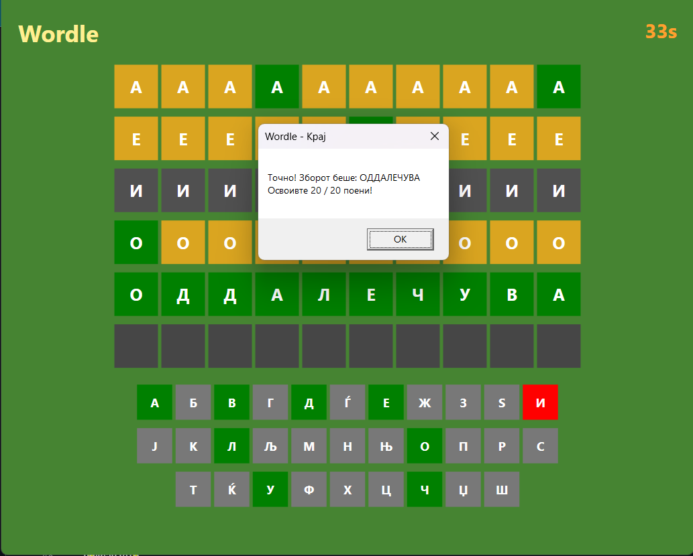
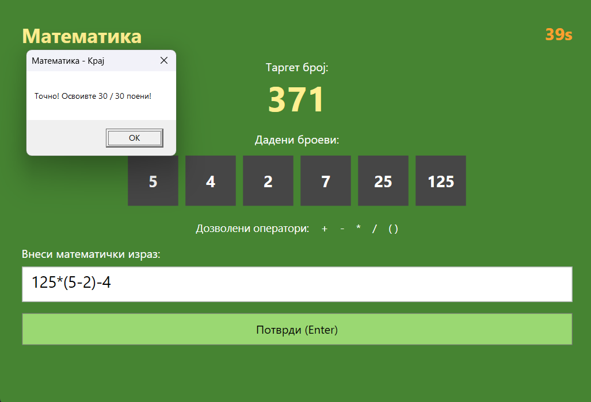
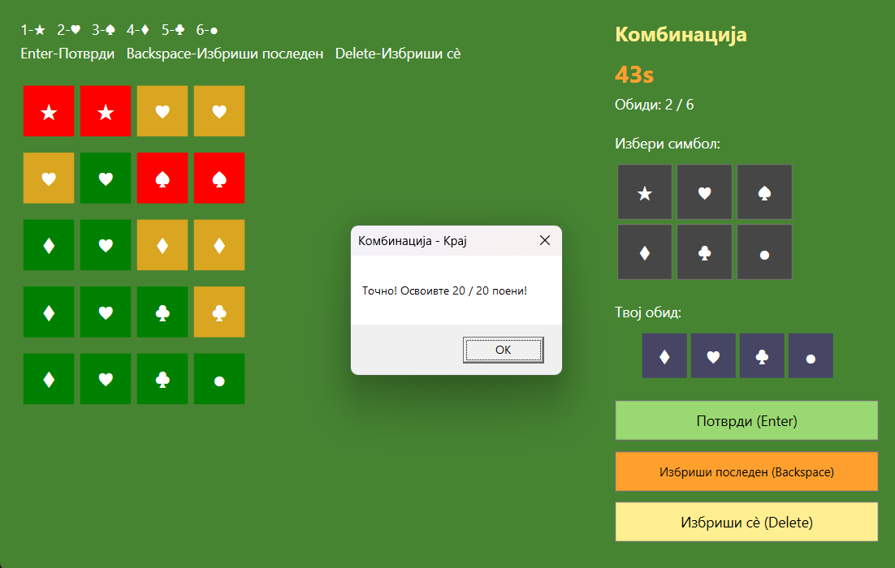
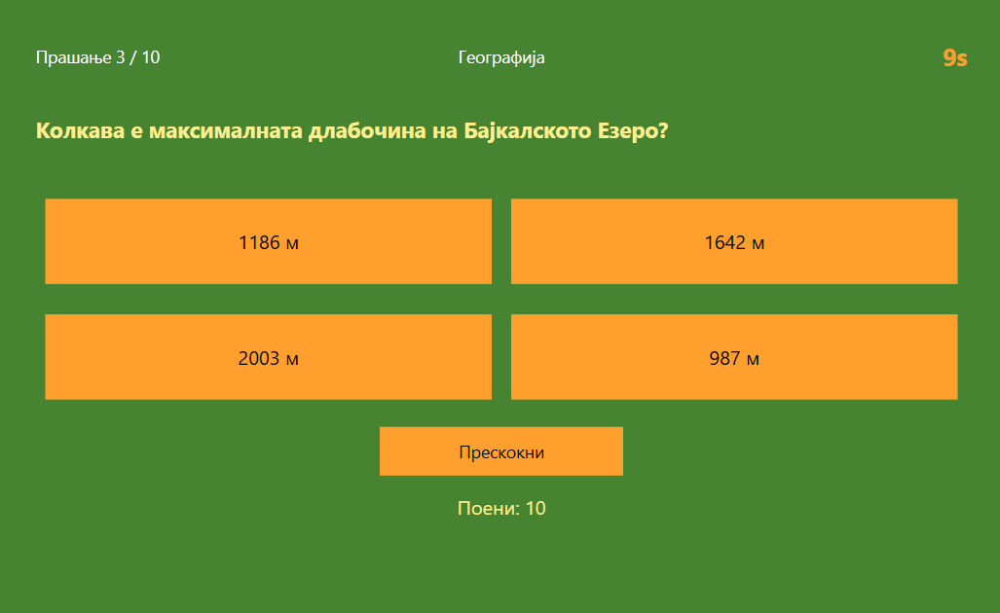
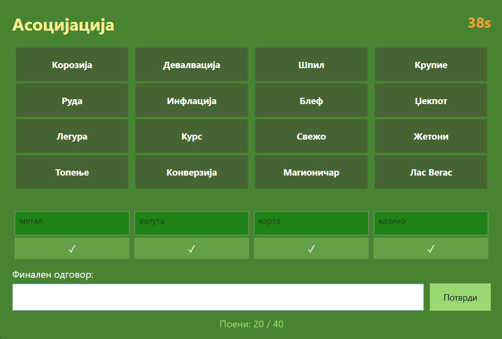
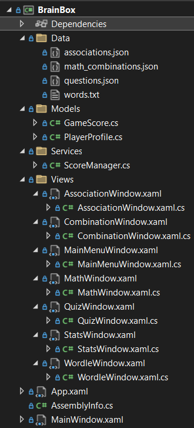
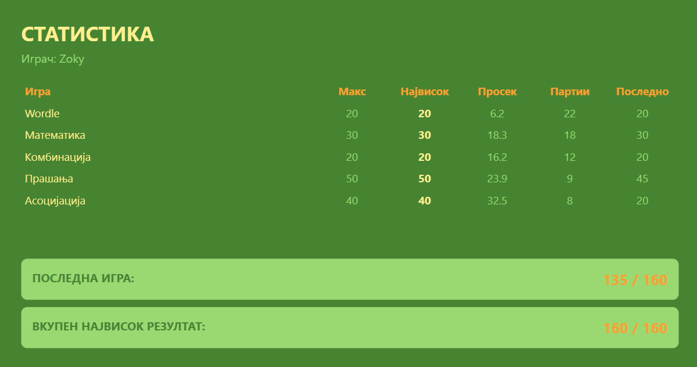

# BrainBox

**Изработиле:**
- Зоран Михаилов — 242006
- Леон Јанески — 241150

## Објаснување на проектот

BrainBox е десктоп апликација развиена во **C# со WPF framework** која содржи пет мини-игри: Wordle, Математика, Комбинација, Прашања и Асоцијација. Секоја игра го предизвикува играчот на поинаков начин. Апликацијата го памети највисокиот резултат, просекот, бројот на партии и последниот резултат за секоја игра одделно. 



---

### Правила на игрите

**Wordle** — Играчот има шест обиди да погоди скриен збор од десет букви. По секој обид добива повратна информација:
- **Зелена** — точна буква на точна позиција
- **Жолта** — буквата постои но е на погрешно место
- **Сива** — буквата не се наоѓа во зборот



**Математика** — На играчот му се прикажуваат шест броеви (четири едноцифрени, еден двоцифрен и еден трицифрен) и таргет број од 1 до 999. Со помош на основните математички операции `+ - * /` и загради треба да состави израз чиј резултат е што поблиску до таргетот.
- Точен одговор → **30 поени**
- Во опсег од -10 до +10 → **15 поени**
- Подалеку → **0 поени**



**Комбинација** — Се генерира тајна комбинација од четири различни симболи. Играчот има шест обиди да ја погоди. По секој обид:
- **Зелена** — точен симбол на точна позиција
- **Жолта** — симболот постои но е на погрешно место
- **Црвена** — симболот не е во комбинацијата



**Прашања** — Играчот одговара на десет случајно избрани прашања од општо знаење со по четири понудени одговори. Секое прашање има ограничено време од 11 секунди. Ако го одговори точно позадината на копчето се менува во зелена боја, а ако го погреши позадината се менува во црвена, додека на копчето кое го содржи точниот одговор во зелена.
- Точен одговор → **+5 поени**
- Погрешен одговор → **-5 поени**



**Асоцијација** — Прикажани се четири колони со по четири зборови. Играчот треба да ја открие скриената поврзаност на секоја колона и да ги поврзе сите четири асоцијации во еден финален одговор.
- Точна колона → **5 поени**
- Финален одговор → **20 поени**
- Максимум → **40 поени**



---

## Структура на апликацијата

Апликацијата е организирана во 3 дела:

### Models

Има 2 класи во Models:

Класата `GameScore` чува статистика за една игра:

| | |
|------|------|
| `HighScore` | Највисок постигнат резултат |
| `Average` | Просечен резултат по сите партии |
| `GamesPlayed` | Вкупен број на одиграни партии |
| `MaxScore` | Максималниот можен резултат |
| `LastScore` | Резултатот од последната партија |

Класата `PlayerProfile` чува име на играчот и речник `Dictionary<string, GameScore>` со статистика за секоја од петте игри.

### Services

Класата `ScoreManager` служи за серијализација со помош на `System.Text.Json.JsonSerializer`.

### Views

По еден WPF прозорец за секоја игра, главното мени (`MainMenuWindow`) и статистиката (`StatsWindow`).

### Data фајлови

Содржините на Wordle, Математика, Прашања и Асоцијација се вчитуваат од надворешни фајлови:
- **Data/words.txt** - листа на зборови за Wordle
- **Data/math_combinations.json** - комбинации со решенија за Математика
- **Data/questions.json** - база на прашања за Прашања
- **Data/associations.json** - база на асоцијации за Асоцијација



## Опис на класи и функции
### Класата `GameScore`
```csharp
public class GameScore
{
    public int HighScore { get; set; }
    public double Average { get; set; }
    public int GamesPlayed { get; set; }
    public int MaxScore { get; set; }
    public int LastScore { get; set; }


    public void UpdateScore(int newScore)
    {
        if (newScore > HighScore) HighScore = newScore;
        Average = ((Average * GamesPlayed) + newScore) / (GamesPlayed + 1);
        GamesPlayed++;
        LastScore = newScore;
    }
}
```
Методот `UpdateScore` се повикува по завршување на секоја игра. Алгоритмот за пресметка на просекот работи без да ги чува сите претходни резултати (го користи тековниот просек и бројот на партии за да го пресмета новиот просек)

### Класата `PlayerProfile`
```csharp
public class PlayerProfile
{
    public string Name { get; set; }
    public Dictionary<string, GameScore> Scores { get; set; } = new Dictionary<string, GameScore>()
    {
        { "Wordle",      new GameScore { MaxScore = 20 } },
        { "Matematika",  new GameScore { MaxScore = 30 } },
        { "Kombinacija", new GameScore { MaxScore = 20 } },
        { "Prasanja",    new GameScore { MaxScore = 50 } },
        { "Asocijacija", new GameScore { MaxScore = 40 } }
    };
}
```

### `WordleWindow` - методот `SubmitGuess`
```csharp
private void SubmitGuess()
{
    if (currentGuess.Length < wordLength)
    {
        MessageBox.Show("Внеси 10 букви!", "Wordle");
        return;
    }

    Border[] row = grid[currentRow];

    for (int i = 0; i < wordLength; i++)
    {
        string letter = currentGuess[i].ToString();
        Color color;

        if (letter == secretWord[i].ToString())
        {
            color = Colors.Green;
            SetKeyColor(letter, Colors.Green);
        }
        else if (secretWord.Contains(letter))
        {
            color = Colors.Goldenrod;
            SetKeyColor(letter, Colors.Goldenrod);
        }
        else
        {
            color = Color.FromRgb(80, 80, 80);
            SetKeyColor(letter, Colors.Red);
        }

        row[i].Background = new SolidColorBrush(color);
    }

    if (currentGuess == secretWord)
    {
        timer.Stop();
        score = CalculateScore();
        EndGame(true);
        return;
    }

    currentRow++;
    currentGuess = "";

    if (currentRow >= maxRows)
    {
        timer.Stop();
        EndGame(false);
    }
}
```
Функцијата се повикува кога играчот притиска Enter. Прво проверува дали се внесени сите 10 букви, ако не, прикажува порака и запира. Потоа за секоја буква прави три проверки по ред: ако буквата е на точна позиција - ја обојува во зелена, ако буквата постои во зборот но е на погрешна позиција - ја обојува во жолта, а ако не постои во зборот - ја обојува во сива. Паралелно со бојата на квадратчето, се ажурира и бојата на соодветното копче на тастатурата преку `SetKeyColor`. По боењето, проверува дали целиот збор е погоден, ако да, го пресметува резултатот и завршува со победа. Ако не, поминува на следен ред. Ако се потрошени сите 6 редови — завршува со пораз.

### `MathWindow` - дел од методот `ConfirmAnswer`
```csharp
string expr = txtExpression.Text.Trim();
if (expr == "")
{
    txtMessage.Text = "Внеси математички израз!";
    return;
}

MatchCollection matches = Regex.Matches(expr, @"\d+");
List<int> koristeni = new List<int>();
foreach (Match m in matches)
{
    koristeni.Add(int.Parse(m.Value));
}

List<int> dostapni = new List<int>(numbers);
for (int i = 0; i < koristeni.Count; i++)
{
    int n = koristeni[i];
    if (dostapni.Contains(n))
    {
        dostapni.Remove(n);
    }
    else
    {
        txtMessage.Text = "Бројот " + n + " не е дозволен или веќе е употребен!";
        return;
    }
}
```
Функцијата прво го зема текстот од текст-полето и ги отстранува празните места со Trim(). Ако полето е празно, прикажува порака и запира.
Потоа следи валидација на употребените броеви. Со Regex `\d+` (кој значи "еден или повеќе цифри") се извлекуваат сите броеви од изразот — на пример за изразот (100+25)*3 ќе се извлечат 100, 25 и 3.
За да се провери дали играчот користи само дозволени броеви, се прави копија `dostapni` од оригиналната листа на броеви. За секој употребен број се проверува дали постои во `dostapni`, ако постои, се брише од копијата (за да не може да се употреби двапати). Ако не постои, играчот употребил недозволен број и се прикажува порака за грешка.

### `CombinationWindow` - методот `GenerateSecret`
```csharp
private void GenerateSecret()
{
    Random rnd = new Random();
    tajnaKomb = new List<string>();

    List<string> kopija = new List<string>(simboli);
    for (int i = 0; i < 4; i++)
    {
        int index = rnd.Next(kopija.Count);
        tajnaKomb.Add(kopija[index]);
        kopija.RemoveAt(index);
    }
}
```
Функцијата генерира тајна комбинација од 4 различни симболи. Наместо да работи директно со оригиналната листа `simboli`, се прави `kopija` од неа. Потоа во секоја итерација се избира по еден рандом број кој служи како индекс и го додава симболот со тој индекс во `tajnaKomb` и го брише од копијата. Со тоа се оневозможува користење на ист симбол двапати, со што самата комбинација станува потешка да се погоди.

### `QuizWindow` - методот `AnswerClick`
```csharp
private void AnswerClick(object sender, RoutedEventArgs e)
{
    if (odgovoreno) return;
    odgovoreno = true;
    timer.Stop();

    Button btn = (Button)sender;
    string izbran = btn.Content.ToString();

    if (izbran == tekovnoPrasanje.answer)
    {
        btn.Background = new SolidColorBrush(Colors.Green);
        score += 5;
    }
    else
    {
        btn.Background = new SolidColorBrush(Colors.Red);
        if (score > 0) score -= 5;
        ShowCorrectAnswer();
    }

    DisableButtons();
    txtScore.Text = "Поени: " + score;
    GoToNext();
}
```
Функцијата го обработува кликот на одговор. Прво проверува дали веќе е одговорено за да спречи двоен клик. Го зема кликнатото копче преку `sender` и ја чита неговата содржина. Ако е точен одговор, позадината ја менува во зелена и додава 5 поени. Ако е погрешен, позадината ја менува во црвена, одзема 5 поени (само ако `score > 0` за да не оди во негатива) и го прикажува точниот одговор. На крај ги оневозможува сите копчиња и поминува на следно прашање со 1 секунда пауза.

### `AssociationWindow` - методот `ConfirmFinal`
```csharp
private void ConfirmFinal(object sender, RoutedEventArgs e)
{
    if (finalnotoReseno) return;

    string odgovor = txtFinalAnswer.Text.Trim().ToUpper();
    string tocen = tekovnaAsocijacija.finalAnswer.ToUpper();

    if (odgovor == tocen)
    {
        finalnotoReseno = true;

        for (int i = 0; i < 4; i++)
        {
            if (!kolonaResena[i])
            {
                kolonaResena[i] = true;
                score += 5;
                resenijaBoxovi[i].Text = tekovnaAsocijacija.columns[i].solution;
                resenijaBoxovi[i].Background = new SolidColorBrush(Colors.Green);
                resenijaBoxovi[i].IsEnabled = false;
            }
        }

        score += 20;
        txtFinalAnswer.Background = new SolidColorBrush(Colors.Green);
        UpdateScoreUI();
        timer.Stop();
        EndGame();
    }
    else
    {
        txtFinalAnswer.Background = new SolidColorBrush(Colors.DarkRed);
    }
}
```
Функцијата се повикува кога играчот го потврдува финалниот одговор. Прво проверува дали веќе е решено за да спречи двојно повикување. Споредбата на одговорите е case-insensitive — двата стринга се конвертираат во големи букви со `ToUpper()` за да не зависи дали играчот пишувал со големи или мали букви.
Ако одговорот е точен, функцијата минува низ сите 4 колони и проверува која не е решена. За секоја нерешена колона автоматски додава 5 поени и го прикажува точното решение со зелена боја. Ова е логично бидејќи ако играчот го знае финалниот одговор кој ги поврзува сите четири колони, тогаш ги знае и решенијата на поединечните колони. На крај додава 20 поени за финалниот одговор, го запира тајмерот и ја завршува играта.
Ако одговорот е погрешен, само полето за финален одговор се обојува темно црвено и играчот може да продолжи да се обидува.


## Упатство за користење

1. При прво стартување апликацијата бара внесување на име на играчот
2. Се прикажува главното мени со две копчиња — **Старт** и **Статистика**
3. Со клик на **Старт** се отвораат игрите по ред: Wordle → Математика → Комбинација → Прашања → Асоцијација
4. По завршување на сесијата резултатите автоматски се зачувуваат
5. Со клик на **Статистика** се прикажува табела со сите резултати


---

## Користење на вештачка интелигенција
При развојот е користен **Claude** како помош. AI беше користен за:

### Генерирање на содржини
- 50 зборови од 10 букви на македонски јазик
- Околу 50 математички комбинации со дадени решенија
- 100 прашања за квизот на македонски јазик
- Асоцијации на македонски јазик

### Помош при: 
- Објаснување на WPF концепти (XAML layout, DispatcherTimer, динамичко градење на интерфејс)
- Насоки за структура на некои класи
- Поедноставување на некои функции, на пример за пресметување на математички израз во `ConfirmAnswer` со користење на `DataTable.Compute(expr, null)`
- Стилизирање и динамичко градење на интерфејсот
- Мапирање на македонската тастатура во `WordleWindow`
- JSON серијализација и десеријализација со `System.Text.Json.JsonSerializer` за зачувување и вчитување на профилот на играчот (`player_data.json`) и за вчитување на содржините на игрите од `Data` фолдерот
- Решавање на проблемот со промена на боја на WPF копчиња при клик
- Решавање на двојно повикување на `EndGame` во `MathWindow`

### Напомена
Целиот изворен код е пишуван од страна на авторите. Claude беше користен само како помош, не за целосно генерирање на апликацијата.